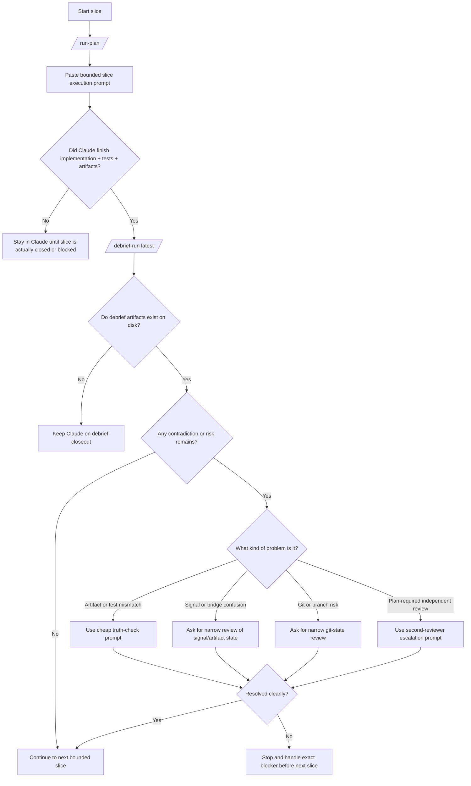

# Cost-Controlled Slice Execution Flowchart

Companion to [claude-prompt-pack-cost-controlled-slice-execution.md](./claude-prompt-pack-cost-controlled-slice-execution.md).

Use this when you want the shortest possible operator decision path for a bounded Mythos slice.



## Operator Shortcut

If all of these are true, do not pay for a second review:

- Claude changed only the bounded slice
- targeted tests passed
- required artifacts exist on disk
- `/debrief-run latest` completed
- the next command is obvious

If any of these are false, escalate narrowly rather than reopening the whole session.

## Minimal Command Sequence

```text
/run-plan <task-or-plan-id>
```

Then paste the bounded-slice execution prompt from the companion prompt pack.

When the slice is done:

```text
/debrief-run latest
```

Only then decide whether a second reviewer is needed.
